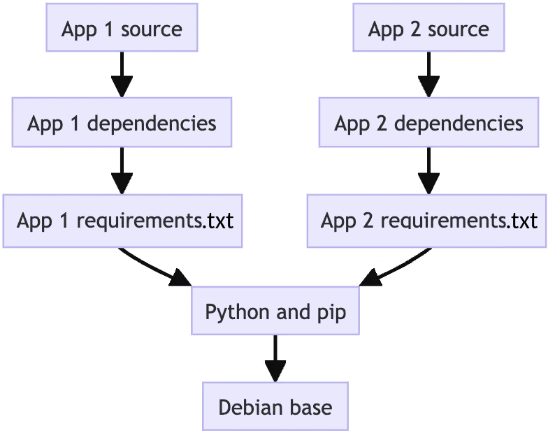

Docker и ко
===========

# Docker

## Введение в Docker

Образ состоит из слоёв.
Каждый слой является неизменяемым.
Смысл в том, что один и тот же слой может использоваться несколькими образами.



`Dockerfile` — это инструкция для создания образа.

Всю работу выполняет демон, утилита `docker` лишь отсылает ему команды.

OCI (Open Container Initiative) — это проект, определяющий открытые стандарты для образов и сред выполнения контейнеров ака container runtimes.

CRI (Container Runtime Interface) — это интерфейс, определяющий взаимодействие Kubernetes и среды выполнения контейнеров.

containerd — это демон, который запускает контейнеры и управляет ими.
Поддерживает стандарты OCI, имеется плагин для поддержки CRI.

# Docker CLI


# Внутреннее устройство Docker-реестра

Манифест — это JSON-документ, описывающий образ.
Стандартный манифест (тип `application/vnd.docker.distribution.manifest.v2+json`) описывает слои и конфигурационный блоб.
Пример:
```
{
    "schemaVersion": 2,
    "mediaType": "application/vnd.docker.distribution.manifest.v2+json",
    "config": {
       "mediaType": "application/vnd.docker.container.image.v1+json",
       "size": 1402,
       "digest": "sha256:a7d85984bee3d822fd3b3c25454575645b3a512240130a7c03b87528f8e42fce"
    },
    "layers": [
        {
            "mediaType": "application/vnd.docker.image.rootfs.diff.tar.gzip",
            "size": 3799689,
            "digest": "sha256:9824c27679d3b27c5e1cb00a73adb6f4f8d556994111c12db3c5d61a0c843df8"
        },
        ...
    ]
}
```

Ид блоб — это его контрольная сумма sha256, ид манифеста — аналогично.
Манифесты и блоб являются неизменяемыми, т.к. правки ведут к изменению контрольной суммы.

Один тег может содержать образы для разных архитектур.
Такому тегу соответсвует манифест типа `application/vnd.docker.distribution.manifest.list.v2+json` ака fat manifest.
Пример:
```
{
    "schemaVersion": 2,
    "mediaType": "application/vnd.docker.distribution.manifest.list.v2+json",
    "manifests": [
        {
            "mediaType": "application/vnd.docker.distribution.manifest.v2+json",
            "digest": "sha256:e692418e4cbaf90ca69d05a66403747baa33ee08806650b51fab815ad7fc331f",
            "size": 7143,
            "platform": {"architecture": "ppc64le", "os": "linux"}
        },
        ...
    ]
}
```

Манифест можно скачать как по тегу, так и по хешу манифеста:
```
GET /v2/⟨img⟩/manifests/⟨tag or hash⟩"
```

Для заливки именованного манифеста:
```
PUT /v2/⟨img⟩/manifests/⟨tag⟩
```
Этот вызов выполняется после того, как загружены все слои и конфигурационные blobы.

# Docker Compose

Запустить контейнеры в фоновом режиме:
```
$ docker compose up -d
```

Остановить и удалить контейнеры, удалить сети:
```
$ docker compose down
```

Остановить и удалить контейнеры, удалить сети, удалить тома:
```
$ docker compose down -v
```

Остановить и удалить контейнеры, удалить сети, удалить тома и образы:
```
$ docker compose down -v --rmi all --remove-orphans
```
